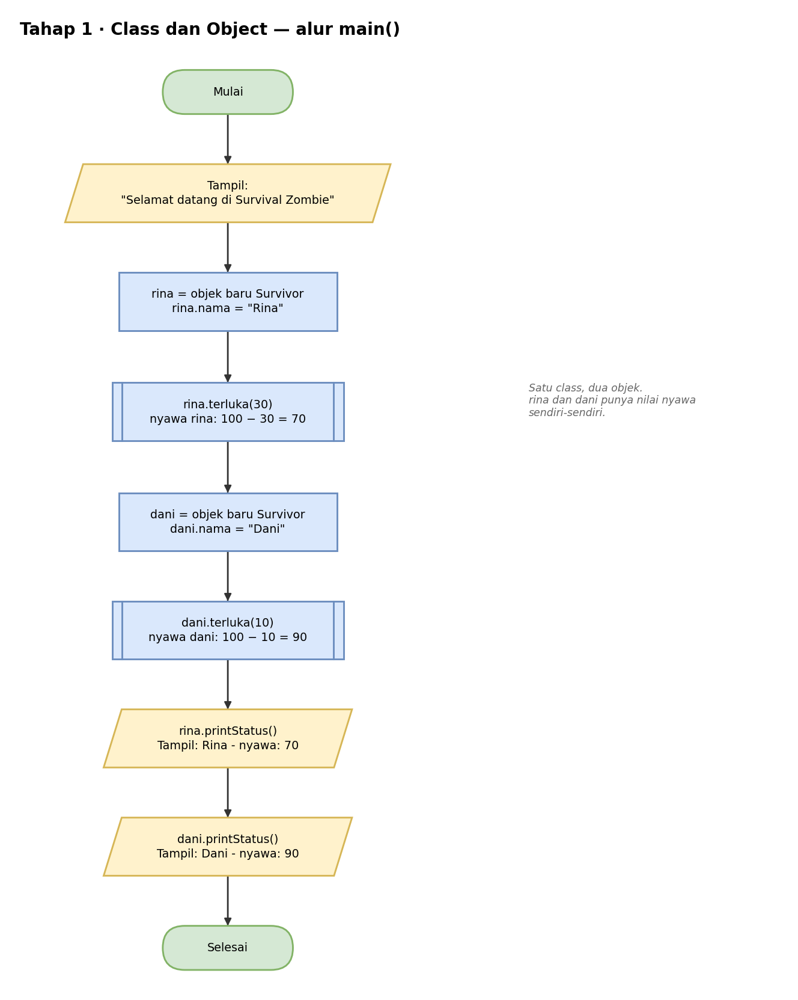

# Pseudocode — Tahap 1: Class dan Object

Konsep: satu class menjadi cetakan, lalu dari cetakan itu dibuat beberapa objek yang punya data sendiri-sendiri.

```text
KELAS Survivor
    ATRIBUT
        nama  : teks
        nyawa : bilangan bulat = 100

    METHOD terluka(damage)
        nyawa = nyawa − damage

    METHOD printStatus()
        TAMPILKAN nama + " - nyawa: " + nyawa
AKHIR KELAS


PROGRAM UTAMA
    TAMPILKAN "Selamat datang di Survival Zombie"

    rina = BUAT OBJEK Survivor        // instance pertama
    rina.nama = "Rina"
    rina.terluka(30)                   // nyawa rina: 100 − 30 = 70

    dani = BUAT OBJEK Survivor        // instance kedua, terpisah dari rina
    dani.nama = "Dani"
    dani.terluka(10)                   // nyawa dani: 100 − 10 = 90

    rina.printStatus()
    dani.printStatus()
AKHIR PROGRAM
```

Hasil yang diharapkan:

```text
Selamat datang di Survival Zombie
Rina - nyawa: 70
Dani - nyawa: 90
```

## Flowchart

Versi yang bisa diedit ada di `flowchart.drawio` (buka dengan draw.io).

### main()



## Cara Membaca

| Tulisan | Artinya |
|---|---|
| `TAMPILKAN` | cetak ke layar (di Java: `System.out.println`) |
| `BUAT OBJEK X` | membuat objek dari class X (di Java: `new X()`) |
| `TURUNAN DARI` | pewarisan (di Java: `extends`) |
| `JIKA ... MAKA ... SELAIN ITU` | percabangan (di Java: `if ... else`) |
| `UNTUK ...` | perulangan (di Java: `for`) |
| `KEMBALIKAN` | mengembalikan nilai dari method (di Java: `return`) |
| `//` | catatan, bukan bagian dari alur |
