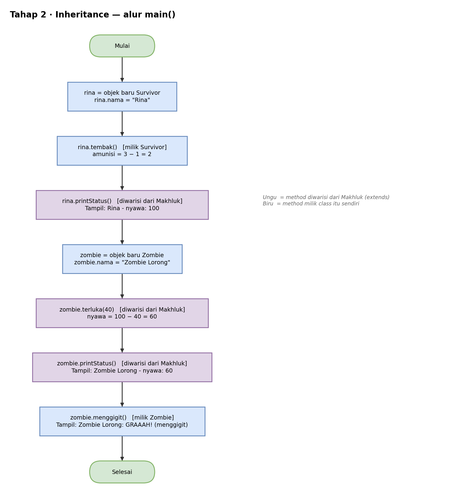

# Pseudocode — Tahap 2: Inheritance

Konsep: bagian yang sama antara `Survivor` dan `Zombie` (nama, nyawa, terluka, printStatus) dipindah ke super-class `Makhluk`. Kedua sub-class tinggal mewarisinya.

```text
KELAS Makhluk
    ATRIBUT
        nama  : teks
        nyawa : bilangan bulat = 100

    METHOD terluka(damage)
        nyawa = nyawa − damage

    METHOD printStatus()
        TAMPILKAN nama + " - nyawa: " + nyawa
AKHIR KELAS


KELAS Survivor TURUNAN DARI Makhluk
    ATRIBUT
        amunisi : bilangan bulat = 3

    METHOD tembak()
        amunisi = amunisi − 1
        TAMPILKAN nama + " menembak! Sisa amunisi: " + amunisi
AKHIR KELAS


KELAS Zombie TURUNAN DARI Makhluk
    METHOD menggigit()
        TAMPILKAN nama + ": GRAAAH! (menggigit)"
AKHIR KELAS


PROGRAM UTAMA
    rina = BUAT OBJEK Survivor
    rina.nama = "Rina"
    rina.tembak()                      // milik Survivor
    rina.printStatus()                 // diwarisi dari Makhluk

    zombie = BUAT OBJEK Zombie
    zombie.nama = "Zombie Lorong"
    zombie.terluka(40)                 // diwarisi dari Makhluk
    zombie.printStatus()               // diwarisi dari Makhluk
    zombie.menggigit()                 // milik Zombie
AKHIR PROGRAM
```

Hasil yang diharapkan:

```text
Rina menembak! Sisa amunisi: 2
Rina - nyawa: 100
Zombie Lorong - nyawa: 60
Zombie Lorong: GRAAAH! (menggigit)
```

## Flowchart

Versi yang bisa diedit ada di `flowchart.drawio` (buka dengan draw.io).

### main()



## Cara Membaca

| Tulisan | Artinya |
|---|---|
| `TAMPILKAN` | cetak ke layar (di Java: `System.out.println`) |
| `BUAT OBJEK X` | membuat objek dari class X (di Java: `new X()`) |
| `TURUNAN DARI` | pewarisan (di Java: `extends`) |
| `JIKA ... MAKA ... SELAIN ITU` | percabangan (di Java: `if ... else`) |
| `UNTUK ...` | perulangan (di Java: `for`) |
| `KEMBALIKAN` | mengembalikan nilai dari method (di Java: `return`) |
| `//` | catatan, bukan bagian dari alur |
