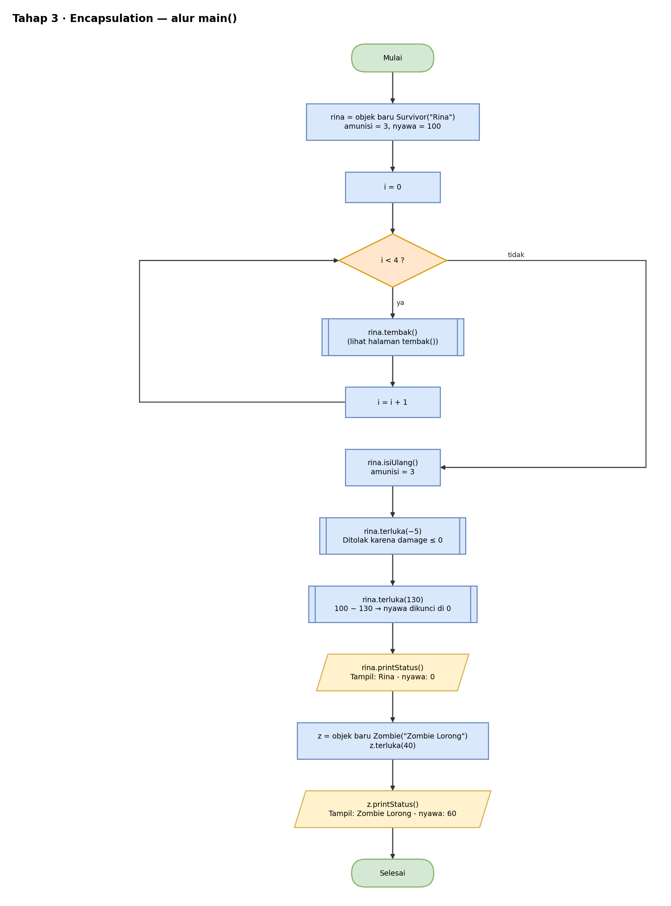
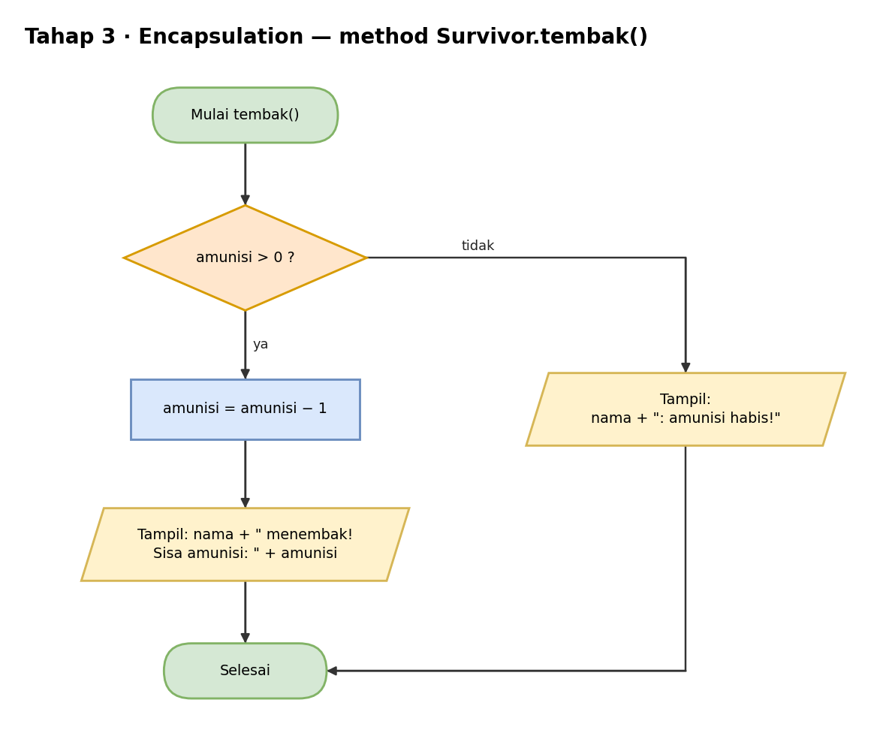
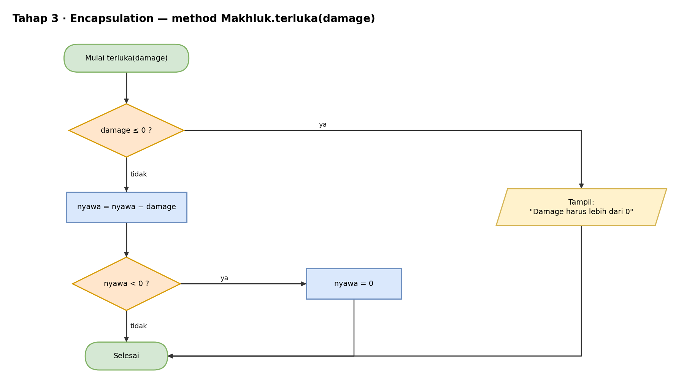

# Pseudocode — Tahap 3: Encapsulation

Konsep: atribut dikunci (`private`) dan hanya bisa diubah lewat method yang punya aturan. Dengan begitu nyawa tidak bisa minus dan amunisi tidak bisa dipakai kalau sudah habis.

```text
KELAS Makhluk
    ATRIBUT PRIVAT
        nama  : teks
        nyawa : bilangan bulat = 100

    KONSTRUKTOR Makhluk(nama)
        this.nama = nama

    METHOD getNama()   → kembalikan nama
    METHOD getNyawa()  → kembalikan nyawa

    METHOD terluka(damage)
        JIKA damage ≤ 0 MAKA
            TAMPILKAN "Damage harus lebih dari 0"
        SELAIN ITU
            nyawa = nyawa − damage
            JIKA nyawa < 0 MAKA
                nyawa = 0
            AKHIR JIKA
        AKHIR JIKA

    METHOD printStatus()
        TAMPILKAN nama + " - nyawa: " + nyawa
AKHIR KELAS


KELAS Survivor TURUNAN DARI Makhluk
    ATRIBUT PRIVAT
        amunisi : bilangan bulat = 3

    METHOD tembak()
        JIKA amunisi > 0 MAKA
            amunisi = amunisi − 1
            TAMPILKAN getNama() + " menembak! Sisa amunisi: " + amunisi
        SELAIN ITU
            TAMPILKAN getNama() + ": amunisi habis!"
        AKHIR JIKA

    METHOD isiUlang()
        amunisi = 3
        TAMPILKAN getNama() + " mengisi ulang amunisi"

    METHOD getAmunisi()  → kembalikan amunisi
AKHIR KELAS


KELAS Zombie TURUNAN DARI Makhluk
    METHOD menggigit()
        TAMPILKAN getNama() + ": GRAAAH! (menggigit)"
AKHIR KELAS


PROGRAM UTAMA
    rina = BUAT OBJEK Survivor("Rina")

    UNTUK i DARI 0 SAMPAI 3           // 4 kali menembak
        rina.tembak()                  // tembakan ke-4 gagal
    AKHIR UNTUK

    rina.isiUlang()
    rina.terluka(−5)                   // ditolak: damage ≤ 0
    rina.terluka(130)                  // nyawa dikunci di 0, bukan −30
    rina.printStatus()

    z = BUAT OBJEK Zombie("Zombie Lorong")
    z.terluka(40)
    z.printStatus()
AKHIR PROGRAM
```

Hasil yang diharapkan:

```text
Rina menembak! Sisa amunisi: 2
Rina menembak! Sisa amunisi: 1
Rina menembak! Sisa amunisi: 0
Rina: amunisi habis!
Rina mengisi ulang amunisi
Damage harus lebih dari 0
Rina - nyawa: 0
Zombie Lorong - nyawa: 60
```

## Flowchart

Versi yang bisa diedit ada di `flowchart.drawio` (buka dengan draw.io).

### main()



### tembak()



### terluka(damage)



## Cara Membaca

| Tulisan | Artinya |
|---|---|
| `TAMPILKAN` | cetak ke layar (di Java: `System.out.println`) |
| `BUAT OBJEK X` | membuat objek dari class X (di Java: `new X()`) |
| `TURUNAN DARI` | pewarisan (di Java: `extends`) |
| `JIKA ... MAKA ... SELAIN ITU` | percabangan (di Java: `if ... else`) |
| `UNTUK ...` | perulangan (di Java: `for`) |
| `KEMBALIKAN` | mengembalikan nilai dari method (di Java: `return`) |
| `//` | catatan, bukan bagian dari alur |
