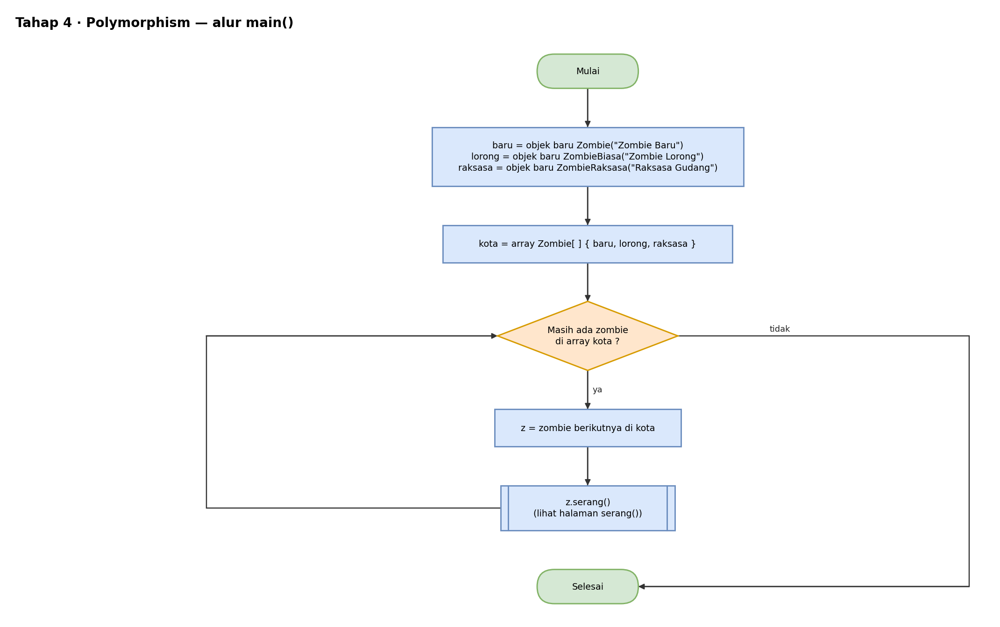
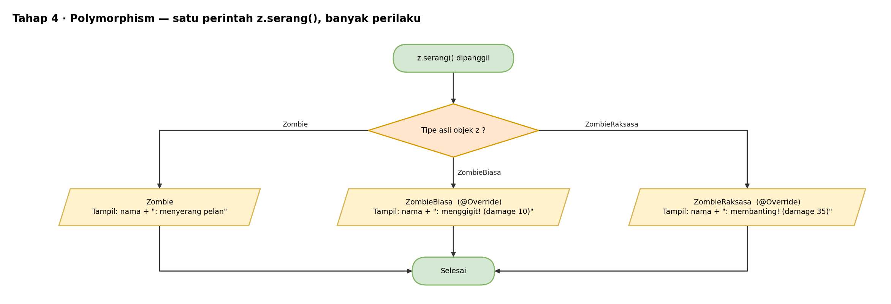

# Pseudocode — Tahap 4: Polymorphism

Konsep: `Zombie` punya method `serang()`, lalu sub-class menimpanya (`@Override`) dengan perilaku masing-masing. Pemanggilnya cukup menulis `z.serang()` tanpa peduli zombie jenis apa.

Bagian `Makhluk` dan `Survivor` sama dengan Tahap 3, jadi tidak diulang di sini.

```text
KELAS Zombie TURUNAN DARI Makhluk
    METHOD serang()
        TAMPILKAN getNama() + ": menyerang pelan"
AKHIR KELAS


KELAS ZombieBiasa TURUNAN DARI Zombie
    METHOD serang()                    // @Override
        TAMPILKAN getNama() + ": menggigit! (damage 10)"
AKHIR KELAS


KELAS ZombieRaksasa TURUNAN DARI Zombie
    METHOD serang()                    // @Override
        TAMPILKAN getNama() + ": membanting! (damage 35)"
AKHIR KELAS


PROGRAM UTAMA
    baru    = BUAT OBJEK Zombie("Zombie Baru")
    lorong  = BUAT OBJEK ZombieBiasa("Zombie Lorong")
    raksasa = BUAT OBJEK ZombieRaksasa("Raksasa Gudang")

    kota = ARRAY Zombie { baru, lorong, raksasa }

    UNTUK SETIAP z DI kota
        z.serang()          // satu perintah, perilaku bergantung tipe asli objek
    AKHIR UNTUK
AKHIR PROGRAM
```

Hasil yang diharapkan:

```text
Zombie Baru: menyerang pelan
Zombie Lorong: menggigit! (damage 10)
Raksasa Gudang: membanting! (damage 35)
```

## Flowchart

Versi yang bisa diedit ada di `flowchart.drawio` (buka dengan draw.io).

### main()



### serang()



## Cara Membaca

| Tulisan | Artinya |
|---|---|
| `TAMPILKAN` | cetak ke layar (di Java: `System.out.println`) |
| `BUAT OBJEK X` | membuat objek dari class X (di Java: `new X()`) |
| `TURUNAN DARI` | pewarisan (di Java: `extends`) |
| `JIKA ... MAKA ... SELAIN ITU` | percabangan (di Java: `if ... else`) |
| `UNTUK ...` | perulangan (di Java: `for`) |
| `KEMBALIKAN` | mengembalikan nilai dari method (di Java: `return`) |
| `//` | catatan, bukan bagian dari alur |
