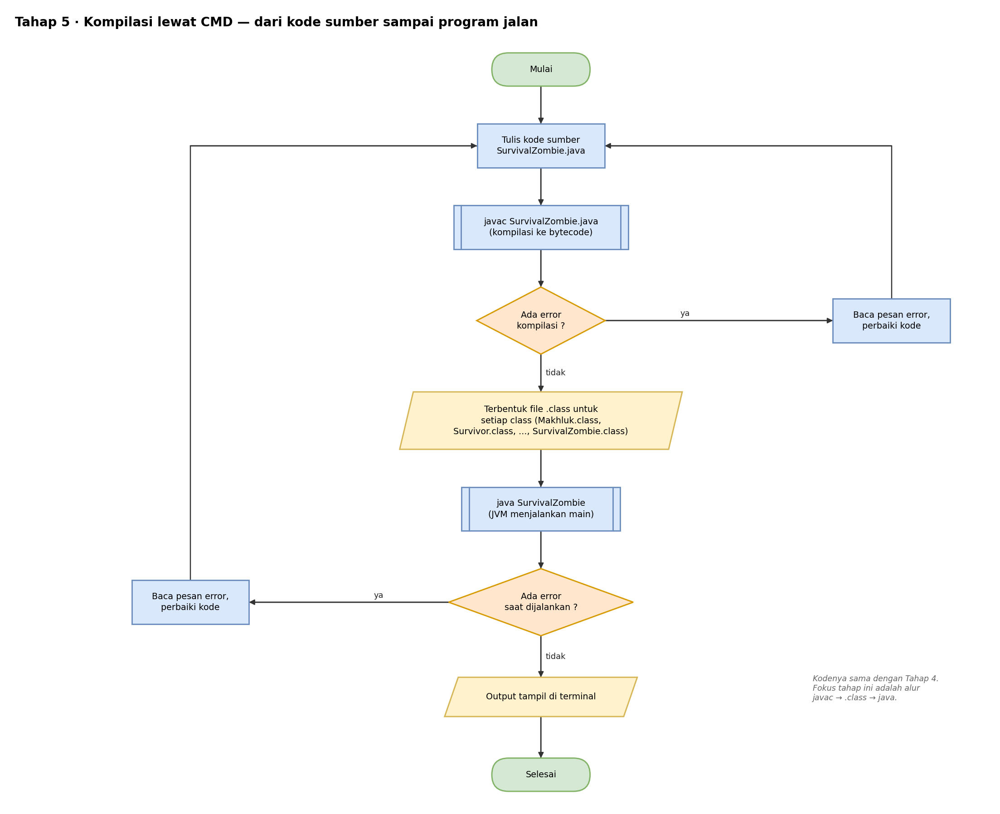

# Pseudocode — Tahap 5: Kompilasi lewat Command Line

Konsep: kode program Tahap 5 sama persis dengan Tahap 4. Yang dipelajari adalah **alur** dari kode sumber sampai program berjalan.

```text
ALUR KERJA

    1. TULIS kode sumber → SurvivalZombie.java

    2. KOMPILASI
        jalankan:  javac SurvivalZombie.java
        JIKA ada error kompilasi MAKA
            baca pesan error, perbaiki kode
            ULANGI dari langkah 1
        SELAIN ITU
            terbentuk file .class untuk SETIAP class:
                Makhluk.class, Survivor.class, Zombie.class,
                ZombieBiasa.class, ZombieRaksasa.class,
                SurvivalZombie.class
        AKHIR JIKA

    3. EKSEKUSI
        jalankan:  java SurvivalZombie       // tanpa .java atau .class
        JVM mencari method main di class SurvivalZombie
        JIKA ada error saat dijalankan MAKA
            baca pesan error, perbaiki kode
            ULANGI dari langkah 1
        SELAIN ITU
            output tampil di terminal
        AKHIR JIKA
```

Isi `main()` sama dengan Tahap 4. Hasil yang diharapkan:

```text
Zombie Baru: menyerang pelan
Zombie Lorong: menggigit! (damage 10)
Raksasa Gudang: membanting! (damage 35)
```

Dua jenis error yang berbeda:

| Jenis | Muncul saat | Contoh |
|---|---|---|
| Error kompilasi | `javac` | titik koma hilang, nama variabel salah ketik |
| Error runtime | `java` | program sudah jalan, lalu gagal di tengah |

## Flowchart

Versi yang bisa diedit ada di `flowchart.drawio` (buka dengan draw.io).

### Alur kompilasi



## Cara Membaca

| Tulisan | Artinya |
|---|---|
| `TAMPILKAN` | cetak ke layar (di Java: `System.out.println`) |
| `BUAT OBJEK X` | membuat objek dari class X (di Java: `new X()`) |
| `TURUNAN DARI` | pewarisan (di Java: `extends`) |
| `JIKA ... MAKA ... SELAIN ITU` | percabangan (di Java: `if ... else`) |
| `UNTUK ...` | perulangan (di Java: `for`) |
| `KEMBALIKAN` | mengembalikan nilai dari method (di Java: `return`) |
| `//` | catatan, bukan bagian dari alur |
