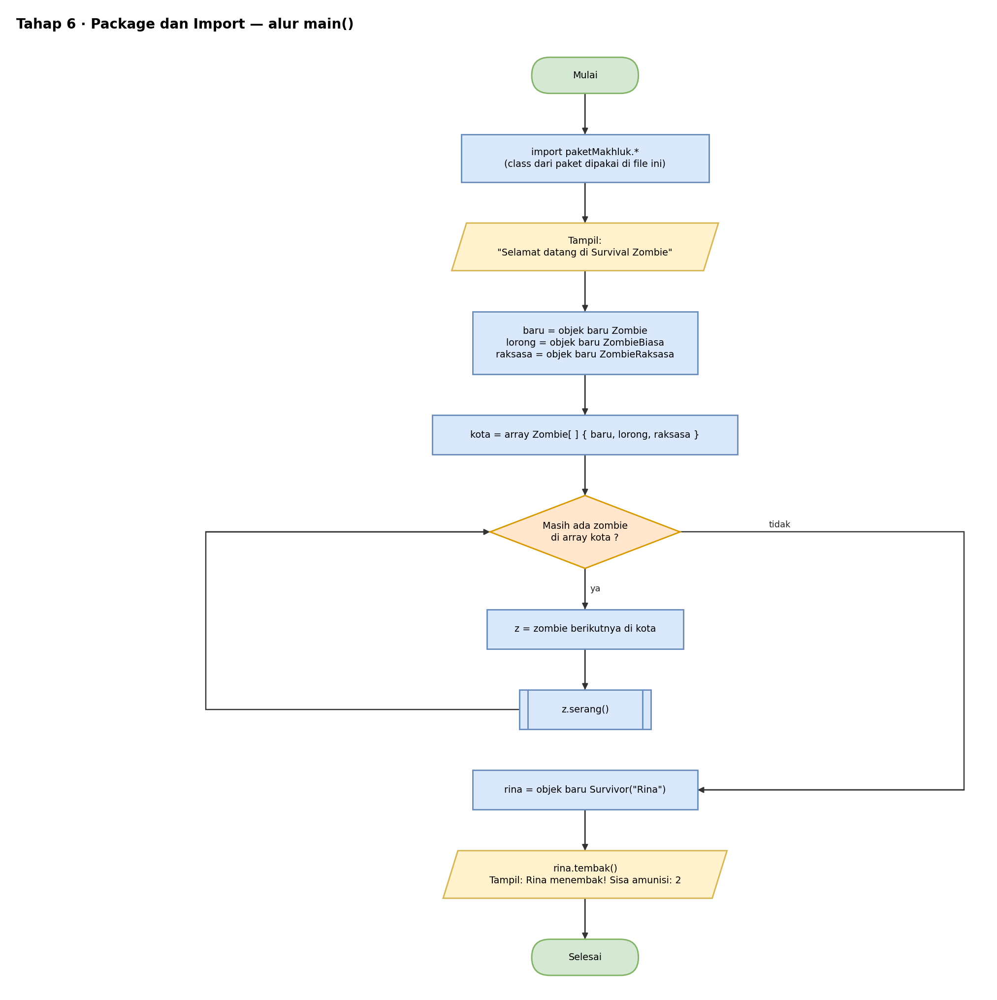
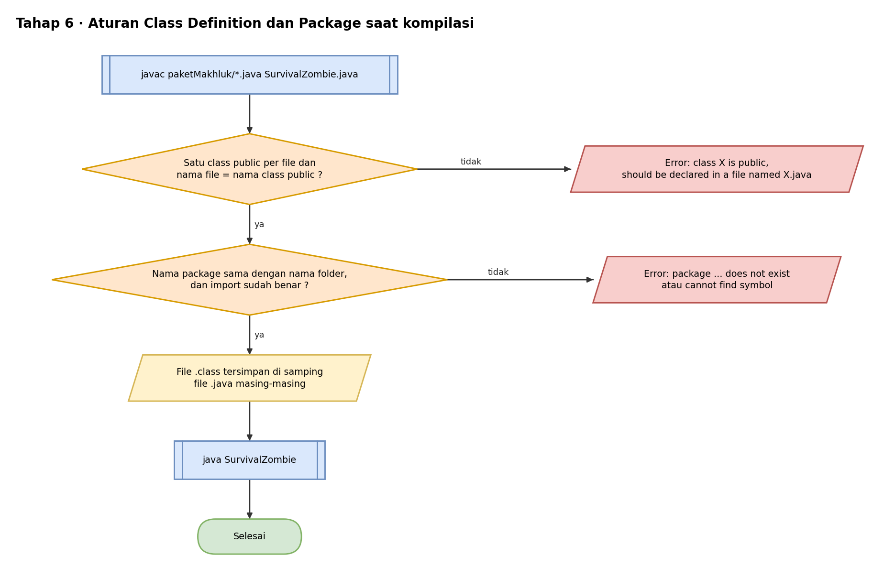

# Pseudocode — Tahap 6: Package, Import, dan Class Definition

Konsep: class dikelompokkan ke dalam paket (`paketMakhluk`) dan dipakai dari file lain lewat `import`. Mulai tahap ini, setiap class `public` ada di file sendiri.

```text
// File: paketMakhluk/Makhluk.java, Survivor.java, Zombie.java,
//       ZombieBiasa.java, ZombieRaksasa.java
PAKET paketMakhluk
    KELAS PUBLIK Makhluk ...
    KELAS PUBLIK Survivor TURUNAN DARI Makhluk ...
    KELAS PUBLIK Zombie TURUNAN DARI Makhluk ...
    KELAS PUBLIK ZombieBiasa TURUNAN DARI Zombie ...
    KELAS PUBLIK ZombieRaksasa TURUNAN DARI Zombie ...
AKHIR PAKET


// File: SurvivalZombie.java
IMPOR paketMakhluk.*                  // semua class di folder paketMakhluk

PROGRAM UTAMA
    TAMPILKAN "Selamat datang di Survival Zombie"

    baru    = BUAT OBJEK Zombie("Zombie Baru")
    lorong  = BUAT OBJEK ZombieBiasa("Zombie Lorong")
    raksasa = BUAT OBJEK ZombieRaksasa("Raksasa Gudang")

    kota = ARRAY Zombie { baru, lorong, raksasa }
    UNTUK SETIAP z DI kota
        z.serang()
    AKHIR UNTUK

    rina = BUAT OBJEK Survivor("Rina")
    rina.tembak()
AKHIR PROGRAM
```

Aturan yang dicek compiler:

```text
JIKA lebih dari satu class public dalam satu file MAKA     error
JIKA nama file ≠ nama class public MAKA                    error
JIKA nama package ≠ nama folder MAKA                       error
JIKA class dari paket lain dipakai tanpa import MAKA       error (cannot find symbol)
```

Hasil yang diharapkan:

```text
Selamat datang di Survival Zombie
Zombie Baru: menyerang pelan
Zombie Lorong: menggigit! (damage 10)
Raksasa Gudang: membanting! (damage 35)
Rina menembak! Sisa amunisi: 2
```

## Flowchart

Versi yang bisa diedit ada di `flowchart.drawio` (buka dengan draw.io).

### main()



### Aturan kompilasi



## Cara Membaca

| Tulisan | Artinya |
|---|---|
| `TAMPILKAN` | cetak ke layar (di Java: `System.out.println`) |
| `BUAT OBJEK X` | membuat objek dari class X (di Java: `new X()`) |
| `TURUNAN DARI` | pewarisan (di Java: `extends`) |
| `JIKA ... MAKA ... SELAIN ITU` | percabangan (di Java: `if ... else`) |
| `UNTUK ...` | perulangan (di Java: `for`) |
| `KEMBALIKAN` | mengembalikan nilai dari method (di Java: `return`) |
| `//` | catatan, bukan bagian dari alur |
