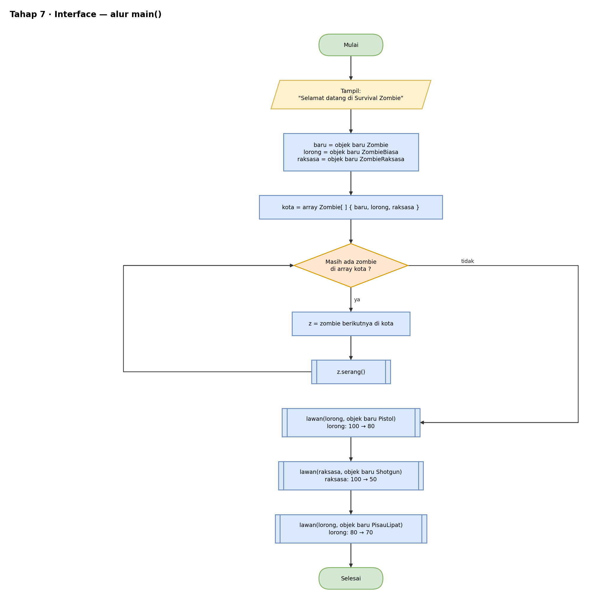
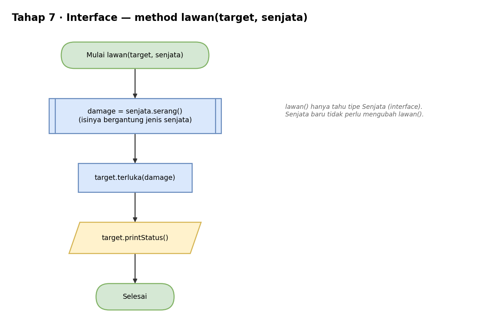
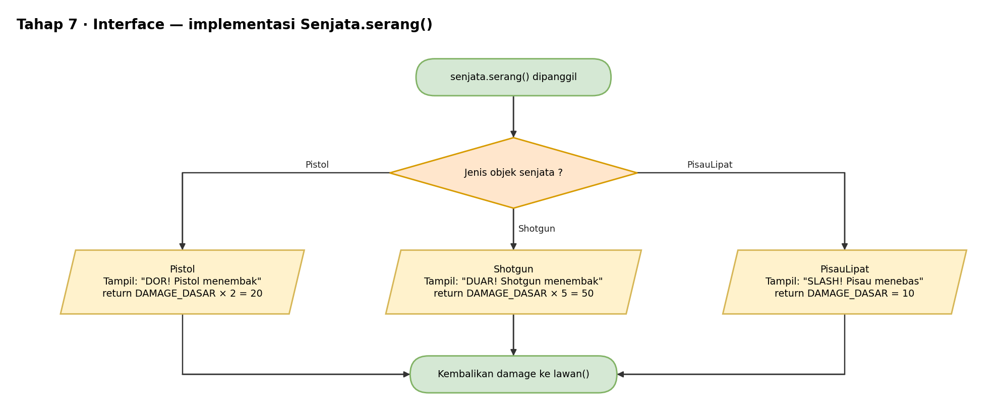

# Pseudocode — Tahap 7: Interface

Konsep: `Senjata` hanya menetapkan **apa** yang harus bisa dilakukan (`serang()`). Tiap senjata menentukan **bagaimana** caranya lewat `implements`. Method `lawan()` bekerja dengan tipe `Senjata`, jadi senjata baru bisa ditambah tanpa mengubah `lawan()`.

```text
// File: paketSenjata/Senjata.java
ANTARMUKA Senjata
    KONSTANTA DAMAGE_DASAR = 10
    METHOD serang() → bilangan bulat       // tanpa isi, hanya kerangka
AKHIR ANTARMUKA


// File: paketSenjata/Pistol.java
KELAS Pistol MENGIMPLEMENTASIKAN Senjata
    METHOD serang()
        TAMPILKAN "DOR! Pistol menembak"
        KEMBALIKAN DAMAGE_DASAR × 2        // 20
AKHIR KELAS

// File: paketSenjata/Shotgun.java
KELAS Shotgun MENGIMPLEMENTASIKAN Senjata
    METHOD serang()
        TAMPILKAN "DUAR! Shotgun menembak"
        KEMBALIKAN DAMAGE_DASAR × 5        // 50
AKHIR KELAS

// File: paketSenjata/PisauLipat.java
KELAS PisauLipat MENGIMPLEMENTASIKAN Senjata
    METHOD serang()
        TAMPILKAN "SLASH! Pisau menebas"
        KEMBALIKAN DAMAGE_DASAR            // 10
AKHIR KELAS


// File: SurvivalZombie.java
IMPOR paketMakhluk.*
IMPOR paketSenjata.*

METHOD lawan(target : Zombie, senjata : Senjata)
    damage = senjata.serang()              // perilaku bergantung jenis senjata
    target.terluka(damage)
    target.printStatus()

PROGRAM UTAMA
    TAMPILKAN "Selamat datang di Survival Zombie"

    baru, lorong, raksasa = buat tiga zombie seperti Tahap 6
    UNTUK SETIAP z DI kota
        z.serang()
    AKHIR UNTUK

    lawan(lorong,  BUAT OBJEK Pistol)      // lorong:  100 → 80
    lawan(raksasa, BUAT OBJEK Shotgun)     // raksasa: 100 → 50
    lawan(lorong,  BUAT OBJEK PisauLipat)  // lorong:   80 → 70
AKHIR PROGRAM
```

Hasil yang diharapkan:

```text
Selamat datang di Survival Zombie
Zombie Baru: menyerang pelan
Zombie Lorong: menggigit! (damage 10)
Raksasa Gudang: membanting! (damage 35)
DOR! Pistol menembak
Zombie Lorong - nyawa: 80
DUAR! Shotgun menembak
Raksasa Gudang - nyawa: 50
SLASH! Pisau menebas
Zombie Lorong - nyawa: 70
```

## Flowchart

Versi yang bisa diedit ada di `flowchart.drawio` (buka dengan draw.io).

### main()



### lawan()



### serang() senjata



## Cara Membaca

| Tulisan | Artinya |
|---|---|
| `TAMPILKAN` | cetak ke layar (di Java: `System.out.println`) |
| `BUAT OBJEK X` | membuat objek dari class X (di Java: `new X()`) |
| `TURUNAN DARI` | pewarisan (di Java: `extends`) |
| `JIKA ... MAKA ... SELAIN ITU` | percabangan (di Java: `if ... else`) |
| `UNTUK ...` | perulangan (di Java: `for`) |
| `KEMBALIKAN` | mengembalikan nilai dari method (di Java: `return`) |
| `//` | catatan, bukan bagian dari alur |
