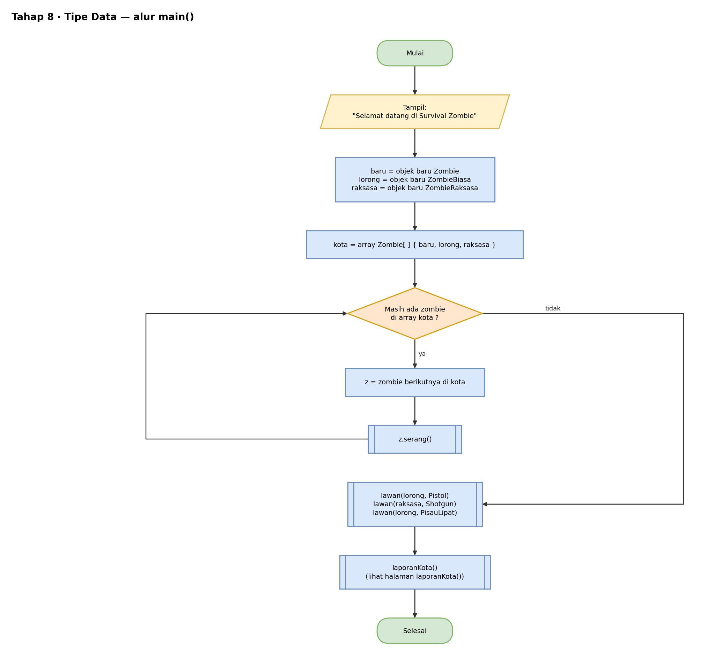
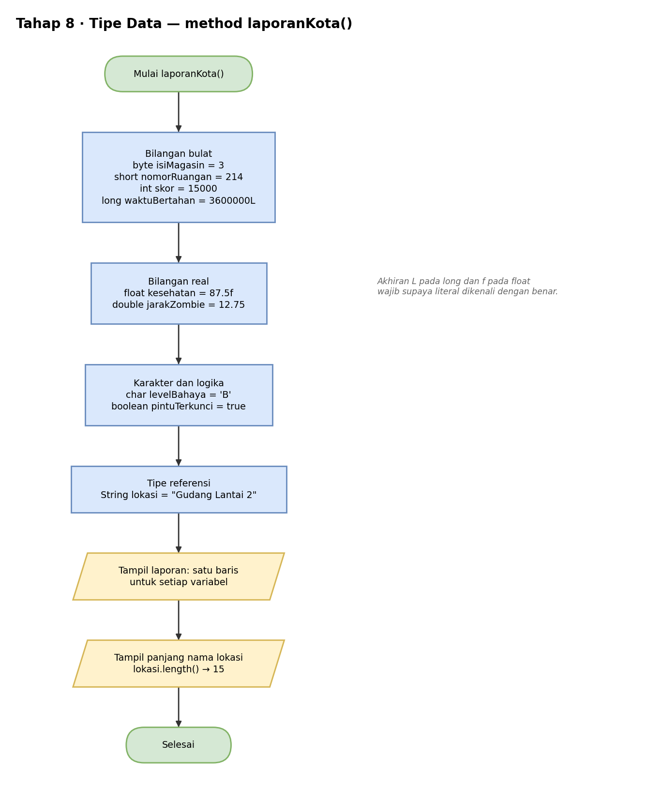
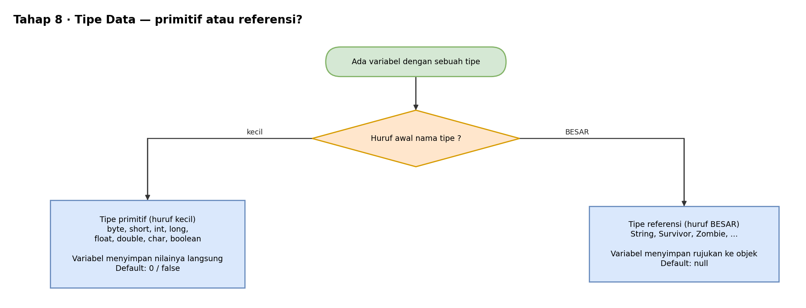

# Pseudocode — Tahap 8: Tipe Data Primitif dan Referensi

Konsep: ada 8 tipe primitif yang menyimpan nilainya langsung, dan tipe referensi (seperti `String` dan class buatan sendiri) yang menyimpan rujukan ke objek.

`main()` sama dengan Tahap 7, ditambah satu pemanggilan `laporanKota()` di akhir.

```text
METHOD laporanKota()
    // bilangan bulat
    byte    isiMagasin    = 3               // 8-bit
    short   nomorRuangan  = 214             // 16-bit
    int     skor          = 15000           // 32-bit
    long    waktuBertahan = 3600000L        // 64-bit, akhiran L

    // bilangan real
    float   kesehatan     = 87.5f           // 32-bit, akhiran f
    double  jarakZombie   = 12.75           // 64-bit

    // karakter dan logika
    char    levelBahaya   = 'B'
    boolean pintuTerkunci = true

    // tipe referensi
    String  lokasi        = "Gudang Lantai 2"

    TAMPILKAN "--- Laporan Survival Zombie ---"
    TAMPILKAN setiap variabel di atas, satu baris per variabel
    TAMPILKAN "Panjang nama lokasi: " + lokasi.length()      // 15
AKHIR METHOD


PROGRAM UTAMA
    ... sama dengan Tahap 7 ...
    laporanKota()
AKHIR PROGRAM
```

Cara membedakan dua kelompok tipe:

```text
JIKA huruf awal nama tipe adalah huruf kecil MAKA      // int, byte, double, ...
    tipe primitif: menyimpan nilai langsung, default 0 / false
SELAIN ITU                                             // String, Zombie, ...
    tipe referensi: menyimpan rujukan ke objek, default null
AKHIR JIKA
```

Hasil bagian `laporanKota()`:

```text
--- Laporan Survival Zombie ---
Lokasi            : Gudang Lantai 2
Isi magasin       : 3
Nomor ruangan     : 214
Skor              : 15000
Waktu bertahan ms : 3600000
Kesehatan (%)     : 87.5
Jarak zombie (m)  : 12.75
Level bahaya      : B
Pintu terkunci    : true
Panjang nama lokasi: 15
```

## Flowchart

Versi yang bisa diedit ada di `flowchart.drawio` (buka dengan draw.io).

### main()



### laporanKota()



### Primitif vs Referensi



## Cara Membaca

| Tulisan | Artinya |
|---|---|
| `TAMPILKAN` | cetak ke layar (di Java: `System.out.println`) |
| `BUAT OBJEK X` | membuat objek dari class X (di Java: `new X()`) |
| `TURUNAN DARI` | pewarisan (di Java: `extends`) |
| `JIKA ... MAKA ... SELAIN ITU` | percabangan (di Java: `if ... else`) |
| `UNTUK ...` | perulangan (di Java: `for`) |
| `KEMBALIKAN` | mengembalikan nilai dari method (di Java: `return`) |
| `//` | catatan, bukan bagian dari alur |
