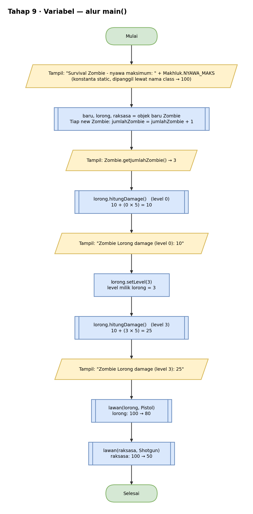
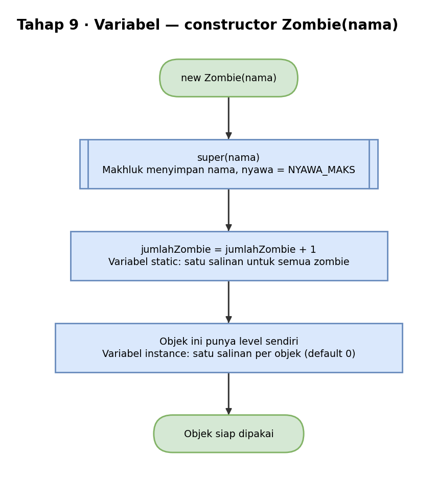
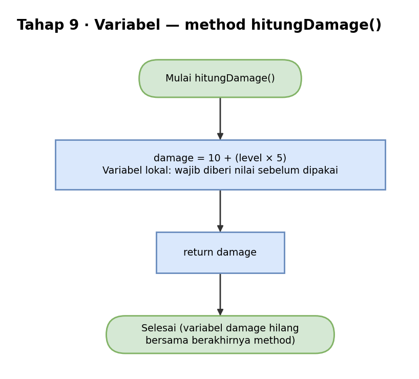
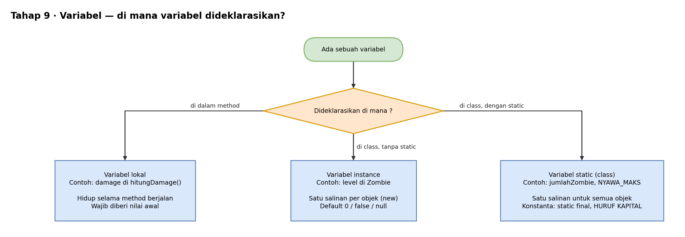

# Pseudocode — Tahap 9: Variabel Lokal, Instance, dan Static

Konsep: tiga jenis variabel dibedakan dari tempat deklarasinya, dan itu menentukan berapa lama ia hidup dan berapa salinannya.

```text
KELAS Makhluk
    KONSTANTA STATIC NYAWA_MAKS = 100       // satu untuk semua, tidak bisa diubah
    nyawa = NYAWA_MAKS
    ...
AKHIR KELAS


KELAS Zombie TURUNAN DARI Makhluk
    ATRIBUT STATIC jumlahZombie = 0         // variabel static: satu salinan untuk semua zombie
    ATRIBUT PRIVAT level = 0                // variabel instance: satu salinan per objek

    KONSTRUKTOR Zombie(nama)
        panggil konstruktor Makhluk(nama)
        jumlahZombie = jumlahZombie + 1     // tiap zombie baru menambah hitungan

    METHOD setLevel(level)
        this.level = level

    METHOD hitungDamage()
        damage = 10 + (level × 5)           // variabel lokal: hanya hidup di method ini
        KEMBALIKAN damage

    METHOD STATIC getJumlahZombie()
        KEMBALIKAN jumlahZombie
AKHIR KELAS


PROGRAM UTAMA
    TAMPILKAN "Survival Zombie - nyawa maksimum: " + Makhluk.NYAWA_MAKS

    baru    = BUAT OBJEK Zombie("Zombie Baru")
    lorong  = BUAT OBJEK ZombieBiasa("Zombie Lorong")
    raksasa = BUAT OBJEK ZombieRaksasa("Raksasa Gudang")

    TAMPILKAN "Jumlah zombie di kota: " + Zombie.getJumlahZombie()     // 3
    TAMPILKAN lorong.getNama() + " damage (level 0): " + lorong.hitungDamage()   // 10
    lorong.setLevel(3)
    TAMPILKAN lorong.getNama() + " damage (level 3): " + lorong.hitungDamage()   // 25

    lawan(lorong,  BUAT OBJEK Pistol)
    lawan(raksasa, BUAT OBJEK Shotgun)
AKHIR PROGRAM
```

Ringkasan tiga jenis variabel:

| Jenis | Contoh | Hidup selama | Salinan |
|---|---|---|---|
| Lokal | `damage` di `hitungDamage()` | method berjalan | dibuat setiap method dipanggil |
| Instance | `level` | objek ada | satu per objek |
| Static | `jumlahZombie`, `NYAWA_MAKS` | program berjalan | satu untuk semua objek |

Hasil yang diharapkan:

```text
Survival Zombie - nyawa maksimum: 100
Jumlah zombie di kota: 3
Zombie Lorong damage (level 0): 10
Zombie Lorong damage (level 3): 25
DOR! Pistol menembak
Zombie Lorong - nyawa: 80
DUAR! Shotgun menembak
Raksasa Gudang - nyawa: 50
```

## Flowchart

Versi yang bisa diedit ada di `flowchart.drawio` (buka dengan draw.io).

### main()



### new Zombie()



### hitungDamage()



### Jenis variabel



## Cara Membaca

| Tulisan | Artinya |
|---|---|
| `TAMPILKAN` | cetak ke layar (di Java: `System.out.println`) |
| `BUAT OBJEK X` | membuat objek dari class X (di Java: `new X()`) |
| `TURUNAN DARI` | pewarisan (di Java: `extends`) |
| `JIKA ... MAKA ... SELAIN ITU` | percabangan (di Java: `if ... else`) |
| `UNTUK ...` | perulangan (di Java: `for`) |
| `KEMBALIKAN` | mengembalikan nilai dari method (di Java: `return`) |
| `//` | catatan, bukan bagian dari alur |
